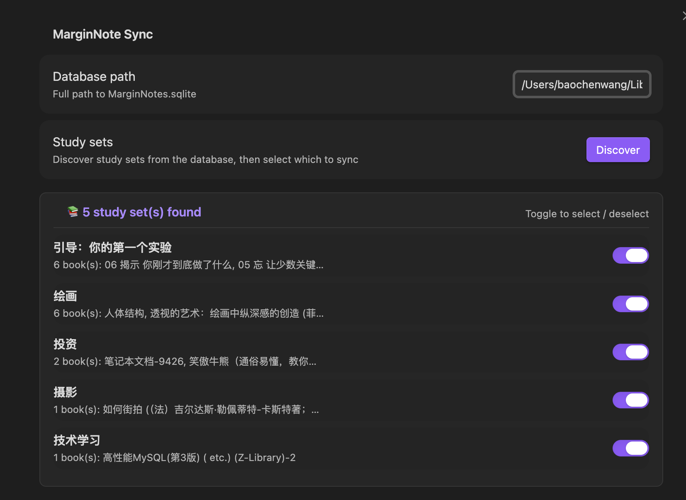
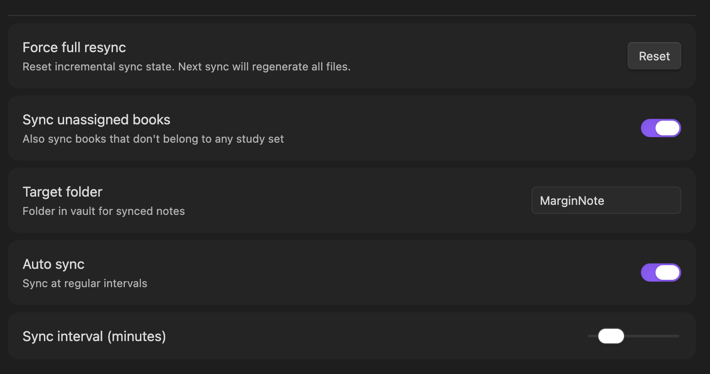
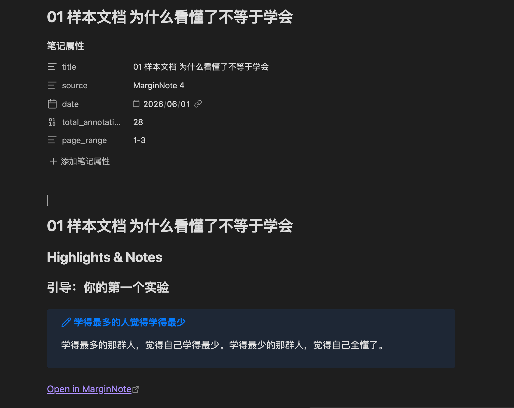
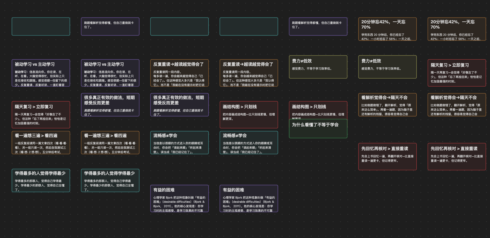

# MarginNote Sync

[](https://github.com/Cheendf/marginnote-obsidian-sync)
[](LICENSE)

将 MarginNote 4 的批注、笔记和思维导图同步到 Obsidian 的插件。

Sync MarginNote 4 annotations, highlights, notes, and mind maps to Obsidian.

---

## 目录（中文）

- [功能展示](#功能展示)
- [功能特性](#功能特性)
- [前置条件](#前置条件)
- [安装](#安装)
- [配置说明](#配置说明)
- [使用方法](#使用方法)
- [输出格式](#输出格式)
- [常见问题](#常见问题)
- [开发指南](#开发指南)
- [赞赏支持](#赞赏支持)

---

## 功能展示

| 设置面板 - 学习集 | 设置面板 - 自动同步 | Markdown 输出 | 思维导图画布 |
|:---:|:---:|:---:|:---:|
|  |  |  |  |

---

## 功能特性

### 核心同步

- **直接读取数据库** — 直接读取 MarginNote 4 的实时 SQLite 数据库（`MarginNotes.sqlite`），无需手动导出或备份
- **Schema 自动发现** — 运行时自动探测 Core Data 的 `Z*` 表结构，兼容 MarginNote 版本更新
- **增量同步** — 仅同步自上次同步后有变更的书籍，基于批注/笔记的修改时间戳判断
- **学习集发现与选择** — 自动扫描数据库中的学习集（多书分组），在设置面板中以可勾选列表呈现
- **学习集子文件夹** — 属于学习集的书籍自动放入 `<目标文件夹>/<学习集名称>/`，未分类书籍直接放在目标文件夹
- **同步未分类书籍** — 可选择是否同步不属于任何学习集的书籍

### 输出格式

- **每书一个 Markdown 文件** — 包含 YAML frontmatter、按章节/页码分组的批注与笔记、思维导图链接
- **Canvas 思维导图** — 将 MarginNote 的层级脑图生成 `.canvas` 文件，带自动布局和色彩映射
- **Obsidian 原生语法** — 使用 `> [!note]` Callout 格式渲染批注，`[[wikilink]]` 引用 Canvas
- **MarginNote 回链** — 每条批注附带 `marginnote4app://note/<UUID>` 深度链接，一键跳回 MN4 对应位置

### 同步控制

- **手动同步** — 侧边栏图标点击 或 `Cmd+P` → "Sync MarginNote notes"
- **自动同步** — 可配置定时同步（1–60 分钟间隔），开启/关闭即时生效
- **强制全量同步** — 设置面板中一键重置时间戳，重新生成所有文件
- **状态栏反馈** — 底部状态栏显示同步状态（同步中 / 成功 / 失败），成功/失败 5 秒后自动消失

### 数据提取

- **书名提取** — 从文件名自动提取书名（去除 `.pdf`/`.epub` 后缀，下划线替换为空格）
- **学习集智能过滤** — 单书籍学习集自动排除系统生成名称，保留用户命名版本
- **批注类型映射** — 原始类型码映射为语义类型：高亮、脑图节点、章节、概念等
- **层级脑图重建** — 从扁平的 `mindLinks` 关系重建父子树，按章节优先→页码→字母顺序排序
- **Apple 时间戳转换** — 将 MN4 内部时间戳（自 2001-01-01 的秒数）转换为 JavaScript Date

---

## 前置条件

- **macOS** 系统（插件依赖系统自带的 `sqlite3` CLI）
- **MarginNote 4** 已安装
- **Obsidian 1.5.0+**（桌面版）

> MN4 数据库默认使用 WAL 模式，读取操作不阻塞 MN4 正常运行。

---

## 安装

### 方法一：社区插件市场（推荐）

在 Obsidian 设置 → 第三方插件 → 浏览 → 搜索 "MarginNote Sync" → 安装并启用。

### 方法二：BRAT

1. 安装 [BRAT](https://github.com/TfTHacker/obsidian42-brat) 插件
2. 在 BRAT 设置中添加 `Cheendf/marginnote-obsidian-sync`

### 方法三：手动安装

```bash
# 将 <vault> 替换为你的仓库名
cp -r marginnote-obsidian-sync \
  "<vault>/.obsidian/plugins/marginnote-sync"
```

开发调试可使用符号链接：

```bash
ln -s /path/to/marginnote-obsidian-sync \
  "<vault>/.obsidian/plugins/marginnote-sync"
```

---

## 配置说明

进入 Obsidian → **设置 → MarginNote Sync**：

| 设置项 | 说明 |
|---|---|
| **Database path** | MarginNote 数据库的完整路径。默认路径：`~/Library/Containers/QReader.MarginStudy.easy/Data/Library/Private Documents/MN4NotebookDatabase/0/MarginNotes.sqlite` |
| **Discover** | 点击后自动扫描数据库中的学习集，并全选。每次 Discover 会触发一次全量同步 |
| **Study sets** | Discover 后显示所有学习集的列表。每个学习集显示名称和包含的书籍数量。可单独勾选需要同步的学习集 |
| **Sync unassigned books** | 是否同步不属于任何学习集的书籍 |
| **Target folder** | 生成的 Markdown/Canvas 文件保存在仓库中的哪个目录（默认 `MarginNote`） |
| **Auto sync** | 启用定时自动同步 |
| **Sync interval** | 自动同步间隔（1–60 分钟），仅在启用 Auto sync 时显示 |
| **Force full resync** | 重置时间戳，下次同步时重新生成所有文件 |

---

## 使用方法

### 手动同步

- 点击 Obsidian 左侧边栏的 MarginNote 图标
- 或使用命令面板 `Cmd+P` → "Sync MarginNote notes"

### 自动同步

在设置中启用 **Auto sync** 并设置间隔时间，插件将在后台定时同步。

### 强制全量同步

在设置面板中点击 **Force full resync** 按钮，然后手动执行一次同步。

### 选择学习集的典型流程

1. **Discover** — 点击 Discover 按钮，扫描数据库中所有学习集
2. **勾选** — 在列表中选择需要同步的学习集
3. **同步** — 执行手动同步或等待自动同步

每次更改学习集勾选状态，插件会自动触发全量同步以确保输出文件与选择一致。

---

## 输出格式

### Markdown 文件

每本书/PDF 生成一个 `.md` 文件：

```markdown
---
title: "书名"
author: "作者"
source: "MarginNote 4"
date: "2025-06-01"
total_annotations: 42
page_range: "10-156"
---

# 书名

## Highlights & Notes

### 章节名

#### Page 10

> [!note] Highlight
> 高亮文本内容

**Note:** 你的笔记

*→ 思维导图节点标题*

*(color: Yellow)*
[Open in MarginNote](marginnote4app://note/UUID)

## Mind Map

> [!info] Mind Map
> 此书的思维导图以 Canvas 格式保存，点击打开：[[书名.canvas|Mind Map Canvas]]
```

- YAML frontmatter 包含书名、作者、来源、日期、批注总数、页码范围
- 批注按**章节 → 页码**两级分组
- 每条批注包含高亮文本、笔记、节点标题、颜色、MarginNote 回链
- 未关联章节的批注归入 **Uncategorized** 分组

### Canvas 思维导图

`.canvas` 文件呈现 MarginNote 中的层级思维导图：

- **自动布局** — 树形结构，父节点居中于子节点上方
- **分组节点** — 子树用半透明背景的 Group 节点包裹
- **色彩映射** — MarginNote 的高亮颜色映射到 Obsidian Canvas 预设色（黄、绿、蓝、红、紫、橙）
- **内容呈现** — 节点标题为 `##` 标题，高亮文本为正文，笔记为斜体

---

## 常见问题

### MarginNote database not found

- 检查设置中的数据库路径是否正确
- 路径应指向 `MarginNotes.sqlite` **文件**，而非文件夹
- 默认路径见[配置说明](#配置说明)

### Failed to load SQLite engine

- 确保 macOS 系统已安装 `sqlite3` CLI（macOS 通常自带）
- 在终端运行 `which sqlite3` 确认

### 同步生成空文件

- 确认数据库路径正确
- 确认 MN4 中有带批注的书籍

### 同步结果与预期不符

- 点击 **Force full resync** 后重新同步
- 检查学习集勾选状态是否正确
- 检查 **Sync unassigned books** 开关是否符合预期

### Cannot find sqlite3 command

部分用户可能移除了系统自带的 sqlite3。重新安装：

```bash
brew install sqlite3
```

### 批注中看不到思维导图节点

- 仅类型为「脑图节点」「章节」「概念」的节点会出现在思维导图中
- 纯高亮（非脑图节点）只出现在 Highlights & Notes 区域

---

## 开发指南

```bash
git clone https://github.com/Cheendf/marginnote-obsidian-sync.git
cd marginnote-obsidian-sync
npm install
```

### 常用命令

| 命令 | 说明 |
|------|------|
| `npm run dev` | esbuild watch 模式，自动重新编译 |
| `npm run build` | 类型检查 + 生产构建 |

### 目录结构

```
├── main.ts                          # 插件入口（Obsidian Plugin API）
├── src/
│   ├── Settings.ts                  # 设置面板和数据模型
│   ├── SyncEngine.ts                # 同步编排
│   ├── parser/
│   │   ├── MNBackupParser.ts        # SQLite 数据库访问
│   │   ├── SchemaInspector.ts       # Schema 自动发现
│   │   └── types.ts                 # 核心数据类型
│   ├── extractor/
│   │   └── NoteExtractor.ts         # 数据库查询与数据组装
│   └── generator/
│       ├── MarkdownGenerator.ts     # Markdown 文件生成
│       └── CanvasGenerator.ts       # Canvas 思维导图生成
├── styles.css                       # 插件样式
├── manifest.json                    # Obsidian 插件清单
└── esbuild.config.mjs               # 构建配置
```

### 技术架构

```
MN4 实时数据库 (MarginNotes.sqlite)
        │
        ▼
  MNBackupParser (sqlite3 CLI, -json 输出)
        │
        ▼
  NoteExtractor (查询、组装、层级重建)
        │
        ▼
  SyncEngine (编排、增量逻辑、文件写入)
        │
        ├──▶ MarkdownGenerator  → .md 文件
        └──▶ CanvasGenerator    → .canvas 文件
```

---

## 赞赏支持

如果这个插件对你有帮助，欢迎赞赏支持 ☕


---

## Table of Contents (English)

- [Features](#features)
- [Prerequisites](#prerequisites)
- [Installation](#installation)
- [Configuration](#configuration)
- [Usage](#usage)
- [Output Format](#output-format)
- [FAQ](#faq)
- [Development](#development)

---

## Features

### Core Sync

- **Direct database access** — Reads MarginNote 4's live SQLite database with no export or backup step
- **Schema auto-discovery** — Probes Core Data `Z*` tables at runtime, compatible with MN4 version updates
- **Incremental sync** — Only syncs books with changes since last sync, based on annotation modification timestamps
- **Study set discovery** — Auto-scans study sets (multi-book groups) and presents them as a toggleable list
- **Subfolder organization** — Study set books placed in `<target>/<StudySetName>/`; unassigned books in root
- **Unassigned book toggle** — Optionally include/exclude books not in any study set

### Output

- **Markdown per book** — YAML frontmatter, highlights grouped by topic & page, mind map wikilink
- **Canvas mind maps** — Hierarchical layout with color mapping and group nodes
- **Obsidian-native syntax** — `> [!note]` callouts, `[[wikilinks]]`
- **MN4 deep links** — `marginnote4app://note/<UUID>` on every annotation

### Sync Controls

- **Manual sync** — Ribbon icon or `Cmd+P` → "Sync MarginNote notes"
- **Auto-sync** — Configurable interval (1–60 minutes)
- **Force full resync** — One-click timestamp reset
- **Status bar** — Visual feedback during and after sync

---

## Prerequisites

- **macOS** (requires built-in `sqlite3` CLI)
- **MarginNote 4**
- **Obsidian 1.5.0+** (desktop)

---

## Installation

### Community Plugin Market (Recommended)

Obsidian → Settings → Community plugins → Browse → "MarginNote Sync" → Install & Enable.

### BRAT

1. Install [BRAT](https://github.com/TfTHacker/obsidian42-brat)
2. Add `Cheendf/marginnote-obsidian-sync` in BRAT settings

### Manual

```bash
cp -r marginnote-obsidian-sync "<vault>/.obsidian/plugins/marginnote-sync"
```

Or symlink for development:

```bash
ln -s /path/to/marginnote-obsidian-sync "<vault>/.obsidian/plugins/marginnote-sync"
```

---

## Configuration

Obsidian → **Settings → MarginNote Sync**:

| Setting | Description |
|---|---|
| **Database path** | Full path to `MarginNotes.sqlite` |
| **Discover** | Scan and list all study sets from the database |
| **Study sets** | Toggle individual study sets for sync |
| **Sync unassigned books** | Include books without a study set |
| **Target folder** | Vault folder for generated files (default: `MarginNote`) |
| **Auto sync** | Enable periodic automatic sync |
| **Sync interval** | Minutes between auto-syncs (1–60) |
| **Force full resync** | Reset timestamp to regenerate all files |

Default database path:

```
~/Library/Containers/QReader.MarginStudy.easy/Data/Library/Private Documents/MN4NotebookDatabase/0/MarginNotes.sqlite
```

---

## Usage

### Manual Sync

Click the ribbon icon or `Cmd+P` → "Sync MarginNote notes".

### Auto Sync

Enable **Auto sync** in settings with desired interval.

### Force Full Resync

Click **Force full resync** in settings, then trigger a sync.

### Study Set Workflow

1. **Discover** — Click to scan all study sets
2. **Select** — Toggle which sets to sync
3. **Sync** — Trigger manual or wait for auto-sync

---

## Output Format

Each book generates a `.md` file with:

- YAML frontmatter (title, author, date, annotation count, page range)
- Highlights & notes grouped by topic → page
- Obsidian callout syntax for annotations
- MN4 deep links on every annotation
- Wikilink to companion `.canvas` mind map file

If the book has mind map nodes, a `.canvas` file is generated with:

- Automatic hierarchical tree layout
- Color mapping (MN highlight colors → Canvas presets)
- Group nodes wrapping subtrees
- Content rendered as headings, body text, and italics

---

## FAQ

### MarginNote database not found

Verify the path in settings points to the `MarginNotes.sqlite` file.

### Failed to load SQLite engine

Ensure `sqlite3` is on PATH. macOS ships with it by default; verify with `which sqlite3`.

### Sync produces empty files

- Verify the database path is correct
- Ensure MN4 has books with annotations

### Results don't match expectations

- Click **Force full resync** and re-sync
- Check study set toggle selections
- Check the **Sync unassigned books** setting

### sqlite3 not found

Reinstall via Homebrew:

```bash
brew install sqlite3
```

### Mind map nodes missing in output

Only annotations typed as mindmap node, chapter, or concept appear in the mind map. Pure highlights appear only in the Highlights & Notes section.

---

## Development

```bash
git clone https://github.com/Cheendf/marginnote-obsidian-sync.git
cd marginnote-obsidian-sync
npm install
```

| Command | Description |
|---------|-------------|
| `npm run dev` | Watch mode with esbuild |
| `npm run build` | Typecheck + production build |

### Architecture

```
MN4 SQLite DB → MNBackupParser → NoteExtractor → SyncEngine
                                                    ├── MarkdownGenerator (.md)
                                                    └── CanvasGenerator (.canvas)
```

---

## Support

If this plugin helps you, consider buying me a coffee ☕


---

## License

MIT © [Cheendf](https://github.com/Cheendf)
